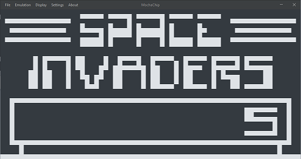
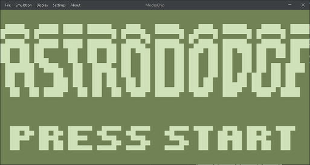
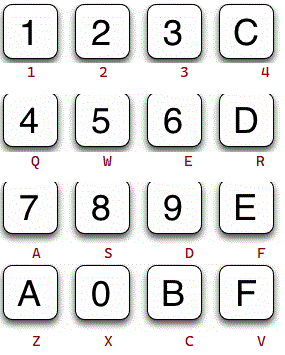

# mochachip.MochaChip





## About

mochachip.MochaChip is an emulator/interpreter for the [CHIP-8 interpreted language](https://en.wikipedia.org/wiki/CHIP-8) written
in Java 17.

CHIP-8 was created in the 1970s to be run on hobbyist 8-bit microcomputers like
the [COSMAC VIP](https://en.wikipedia.org/wiki/COSMAC_VIP). It features a relatively
small and easy-to-use instruction set. Original CHIP-8 programs are limited to 4096 bytes, with the first 512 bytes
reserved
for the interpreter - many extensions to CHIP-8 over the years would greatly extend this limit, as well as add new
instructions
to the interpreter.

Writing a CHIP-8 interpreter is often said to be a great way to get familiarized with emulator development and
understanding low-level computer science concepts. That was my goal here. If you're getting started with programming,
consider writing your own by getting familiar with CHIP-8's architecture (see resources below). It's best to not view anyone else's code until
you've tried to get things working yourself.

## Releases and Usage

Download the [latest release](https://github.com/VinceIP/MochaChip/releases/), extract the archive, and run the MochaChip
JAR file. Requires [Java version 17](https://www.oracle.com/java/technologies/downloads/).

## Why Java?

Mostly just because I like Java, though it may not be the best choice as I've come to learn - read more about that
below.
Regardless, Java offers a lot in terms of very easy to use GUI libraries like Swing. CHIP-8 is an incredibly simple
interpreter
to emulate, so there's not a lot of overhead or performance concerns (also, Java's reputation for poor performance is
largely undeserved).
Drawing CHIP-8's output to the screen is done entirely in Swing by essentially painting rectangles for each pixel.

## Current features

- mochachip.MochaChip can load any .ch8 file through the GUI. Any CHIP-8 program that makes use of an extension like SUPER-CHIP or
  xochip will not work (yet).

- The viewport can be resized by selecting a scale factor in the display menu. The original CHIP-8 is restricted to just
  one foreground and one background color (monochrome black and white). You select a different color theme from the
  display
  menu that may be easier on the eyes.

- The old COSMAC VIPs supported a 16 digit hexadecimal keyboard. The modern convention for emulating this is to
  interpret the top-left
  side of a QWERTY keyboard to correspond to these hex digits, starting at 1 on the keyboard at the top left and V on
  the bottom-right.



## Current bugs

- mochachip.MochaChip can run most(-ish) original CHIP-8 programs. I've found quite a few that do not run yet, likely due to how
  I'm implementing some instructions and working with some of Java's quirks. You will find some of the more complex
  CHIP-8 programs will not run or produce unexpected behavior. Feel free
  to [open an issue](https://github.com/VinceIP/MochaChip/issues)
  if you want to point anything out.

- Pausing/resuming emulation does not yet behave as expected.

- The settings menu is a work in progress.
- Audio beep not yet implemented

## Planned things

- Fullscreen support
- CRT shaders??
- Compatibility for CHIP-8 extensions like SUPER-CHIP and XO-CHIP
- Configurable keybinds with a per-game adjustment
- Suite of debug tools

## CHIP-8 Resources

Want to know more about CHIP-8, or are you writing an emulator of your own? Here's a ton of helpful links.

- [Cowgod's CHIP-8 Technical Reference, ca. 1997](http://devernay.free.fr/hacks/chip8/C8TECH10.HTM)
- [Matthew Mikolay's CHIP-8 Techincal Reference](https://github.com/mattmikolay/chip-8/wiki/CHIP%E2%80%908-Technical-Reference)
- [CHIP-8 Instruction Set cheatsheet](https://johnearnest.github.io/Octo/docs/chip8ref.pdf)
- [CHIP-8 Extensions Reference](https://github.com/mattmikolay/chip-8/wiki/CHIP%E2%80%908-Extensions-Reference)
- [Octo/xochip Extension](https://johnearnest.github.io/Octo/docs/XO-ChipSpecification.html)
- [Emulator 101 - CHIP-8](http://www.emulator101.com/introduction-to-chip-8.html)
- [CHIP-8 Archive - a collection of newer CHIP-8 programs](https://johnearnest.github.io/chip8Archive/)
- [A collection of many old CHIP-8 programs](https://github.com/kripod/chip8-roms)
- [Guide to making a CHIP-8 emulator by Tobias V. Langhoff](https://tobiasvl.github.io/blog/write-a-chip-8-emulator/)

## Personal tidbits, techical deatails, and advice for other Java emulator developers

As of writing, I've only been working on this project for a week or so. Thanks to this [incredibly well-written
guide by Tobias V. Langhoff](https://tobiasvl.github.io/blog/write-a-chip-8-emulator/), I've made a lot of progress in
a short time. Langhoff's guide offers no code snippets and challenges you to implement logic yourself based on
CHIP-8's criteria. A big takeaway I got from this is - it literally does not matter which programming language you choose
to use for a project like this. I've seen a lot of posts on Reddit, mochachip.Stack Overflow and the like by beginners over the years
who struggle with choosing a language for whatever project they want to work on. The more time you spend debating on which
tools to use is less time you have to write code. This goes beyond the scope of writing a simple interpreter. I feel that
modern machines have become fast enough to the point where you don't have to worry THAT much about performance and overhead.
Pick what you're familiar with and what you enjoy using. For me right now, it's Java. If you're writing a 3D renderer from
scratch or targeting mobile devices or web browsers, there's a little more room to debate which tools to use.

That being said, let's talk about **Java and working with small numbers like bytes.** This is long and wordy but my hope
is that it helps someone out who may discover this repo looking for solutions when debugging their own CHIP-8 emulator.

Java is not C, and - oddly enough - it does not support unsigned data types at all. In other words, a Java primitive byte
has a signed range of -128 to 127. This is a problem for this project, because CHIP-8 handles all its operations using
unsigned byte values (0-255). So if I'm decoding a CHIP-8 instruction that adds a value of 2 to register V5 which holds
a value of 255, we expect the result to be 1, because exceeding that signed byte limit of 255 wraps the result back to
0 and adds up from there. This is the expected behavior. In Java, that register (V5) would not hold 255 to begin with.
Signed data uses [two's complement](https://en.wikipedia.org/wiki/Two%27s_complement) to represent negative values in
more modern systems. If we look at the value 255 in binary (11111111), the most significant bit (or the leftmost bit)
is 1, signaling that this is a negative number. To determine the value of the other 7 bits, we flip all bits (convert
1s to 0s and vice versa), giving us 00000000. Then add 1 to the result for 00000001, or decimal 1. We know this number
is negative as indicated by our original most significant bit, so we interpret it as -1. In other words, 255 in CHIP-8
is -1 in Java.

You can imagine how this creates problems when we try to emulate CHIP-8 instructions. Not only that, but any time
math is performed on primitive bytes, Java will upcast those values to 16-bit integers first. For someone like me who
knew very little about binary and hexadecimal going into this, it became very confusing when I saw that my outputs
were nothing like what I expected them to be.

The solution to this problem is bitmasking. Any time I want to perform math on my registers, which I know always hold
8-bit unsigned values, I need to make absolutely sure that I know what Java is doing to these values and that I store
an 8-bit unsigned value back into my register.

For example, say you are emulating CHIP-8's ADD instruction and you have a simple function like this:
```
public void addByte(int x, int nn){

}
```
where int 'x' is the specific register you are adding byte value 'nn' to. For safety, we cannot simply say
```
x += nn
```

and leave it at that. CHIP-8 doesn't really care if this operation overflows the register (sends it back to zero
and counts up if the range is exceeded). In fact, we want this behavior. That wouldn't happen here anyway because
we are using ints that have a limit far beyond what a byte does. We're using ints as parameters because, as I said,
Java will convert a byte to an int behind the scenes anyway when we do math. We're simply going to convert everything
back to 8-bit unsigned values before storing them back into the register 'x'. We do it like this:
```
public void addByte(int x, int nn){
    int vx = registers.variableRegisters[x] & 0xFF;
    int val = nn & 0xFF;
    int result = (vx + val) & 0xFF;
    registers.variableRegisters[x] = (byte)result;
}
```

Let me explain this line-by-line.

```
    int vx = registers.variableRegisters[x] & 0xFF;
```

Create a new int 'vx' to store the value that is currently held in register x. I have my registers in a class separate
from the mochachip.CPU and access them like this. We do a logical AND with the hex value 0xFF or 11111111 in binary. This is called
bitmasking, or extracting only the bits you want from a number. In our case, we don't really know for sure what is
hiding in register 'x'. I know that my registers are a byte[] array, but I don't necessarily know that Java hasn't put
negative numbers in there at some point. By doing a logical AND with 0xFF, we tell Java to just give us back 8 raw
bits from the register and that we aren't interested in two's complement and reading the most significant bit as
a positive/negative switch.

```
    int val = nn & 0xFF
```

We do the exact same thing to 'nn', which a value given to us by the CHIP-8 programmer. Again, we don't know what sort
of value we're getting, so for safety, we restrict it to an unsigned 8-bits by masking with 0xFF.

```
    int result = (vx + val) & 0xFF;
```

Add the two values, while again restricting them to 1 byte unsigned.

```
    registers.variableRegisters[x] = (byte)result;
```

Now that we know our result is in the range we want, we can cast it down to a byte and put it back into the register 'x'.
Note that we don't need to and should not refer to memory addresses or register/array indices with bitmasked unsigned values.

Believe me when I tell you it took me entirely too long to understand this important quirk of Java and why I was seeing
strange and incorrect outputs from my code. Follow this bitmasking rule whenever you are **specifically expecting 8-bit,
unsigned values** from any operation. You can write a function to unsign a value if you want, but I find just adding 
& 0xFF where I need to is just as well.